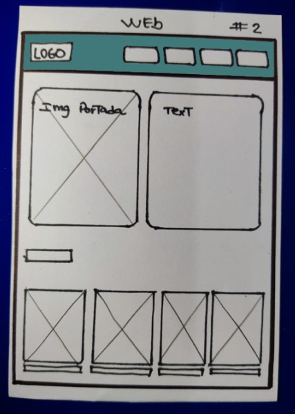
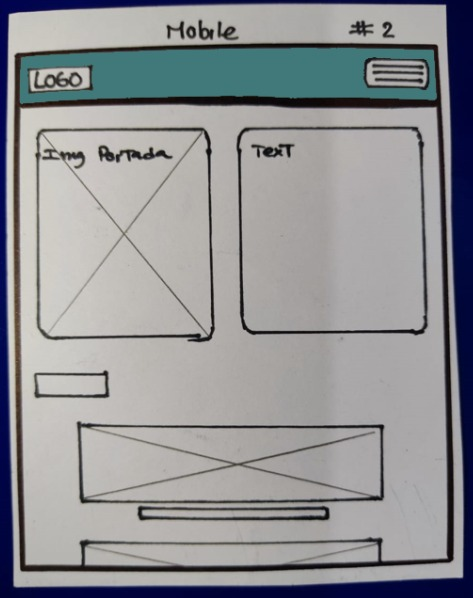
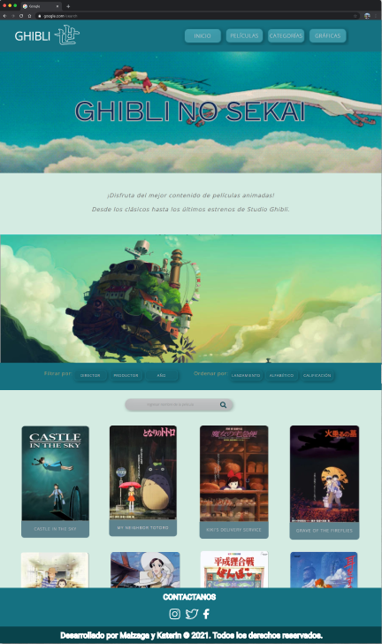

# GHIBLI NO SEKAI

## Descripción

Ghibli no Sekai es una platafoma que le permite a los usuarios acceder a información general y detallada de una gran cantidad de películas producidas por Studio Ghibli.

## Definición del producto

Ghibli no Sekai en una interfaz que le permite a los usuarios poder interactuar y visualizar distintas vistas o secciones, que contienen imagenes y texto referentes a la temática de Studio Ghibli. Para accceder a las distintas vistas, el usuario deberá dar click a los botones de la barra de navegación como a las imágenes de las portadas de las películas u otros elementos que sea "clickeables". 

##  Resumen del proyecto

El proceso de desarrollo de la interfaz Ghibli no Sekai tomo 4 semanas aproximadamente tomando en cuenta la planificación, prototipado, cofidicación del makup en html y css, funcionalidades de js y pruebas. Durante todo el proyecto se realizaron pruebas de usabilidad para corregir y hacer mejoras de las funcionalidades y estilos.

Con respecto a los estilos, aplicamos los 5 principios del diseño y de la misma manera realizamos una investigación para encontrar una paleta de colores que estuviera relacionada a alguna de las películas del studio Ghibli. 

## Diseño de la Interfaz de Usuario

- **Prototipo - Baja fidelidad**

  
Sketch:

  

Prototipo web (vista 1)

    
  

  

Prototipo web (vista 2)

    
  

  

Prototipo mobile (vista 1)

     
  

  

Prototipo mobile (vista 2)

    
  

- **Prototipo - Alta fidelidad**
  
Figma:

  

Link del portafolio de Figma 

    * [Portafolio con los prototipos por cada Sprint](https://www.figma.com/file/Jrh6cG8fDrsgbElrL30FNu/Data-lovers---Team-K%26M?node-id=0%3A1)  
  

   

## Historias de Usuario
  

Link de las historias

   * [Historias de Usuario](https://docs.google.com/document/d/16qly3qnbOpn1K6DCBMk4-HYfJXRKFt7pBAau-bxgvAg/edit)  
  

## Consideraciones generales

* Buscamos que el usuario tenga acceso directo a las distintas vistas desde una barra de menú.
* Que los usuarios desde que ingresaran a la interfaz entendieran la temática del page.
* Que los usuarios se sientan comodos con la paleta de colores y la disposición de las imágenes.
* Que los usuarios interactuaran con la pagina sencilla y de uso muy intuitivo. 

## Problemas detectados a través de tests de usabilidad
1. Las imagenes pueden ser muy grandes.
2. Letras un poco pequeñas.
3. Los dropdonws estan largos.
4. Al seleccionar película la siguiente vista debe visualizarse siempre desde la parte superior.

Link del formulario usado para el test

  * [formulario](https://docs.google.com/forms/d/1CJleVUI6vlU0zUtJsPCDKG6XVD9zySLm_U_sG91EO1Y/viewform?edit_requested=true&fbzx=-1130660339603111466)  

## Link de GitHub Pages 
[Ghibli no Sekai](https://pandartist93.github.io/LIM016-data-lovers/)  

## CONDICIONES DEL PROYECTO 

A continuación encontrarás el link [README.md](https://github.com/Laboratoria/LIM016-data-lovers) que contiene las especificaciones bajo las cuales se realizo el proyecto. 

